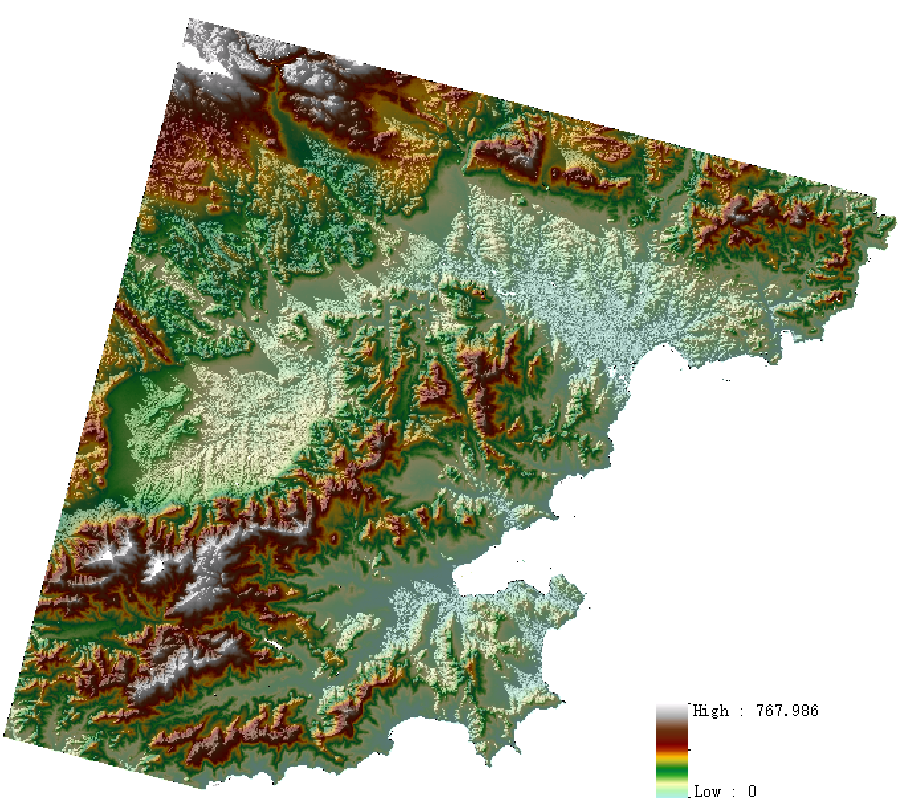

# REPMSatelliteStereo
The code of the paper **Refined equivalent pinhole model for large-scale 3D reconstruction from spaceborne CCD imagery**.

The original paper could be found [here](https://arxiv.org/abs/2310.20117) (Arxiv) and [here](https://doi.org/10.1016/j.jag.2024.104164) (Elsevier).

---
#### This work strongly borrows the insights from the previous VisSatSatelliteStereo approaches. More details in the *Acknowledge* part.

## Introduction

Automatic 3D reconstruction from spaceborne charge-coupled device (CCD) optical imagery is still a challenge  as the rational functional model (RFM) based reconstruction pipeline failed to amount to the advances of  pinhole based approaches in computer vision and photogrammetry.  As a consequence, the accuracy and  completeness of the reconstructed surface by RFM based pipeline improved slightly recent years.  Though the  perspective camera approximation model was explored to convert the RFM to pinhole model, it could hardly  guarantee the reconstruction accuracy due to the re-projection error introduced when approximating the linear  push broom camera to perspective camera.  Hence, we present a refined equivalent pinhole model (REPM)  for 3D reconstruction from spaceborne CCD imagery.  We initially investigated the aspects that influence the  re-projection error thru mathematical induction and discovered that the image size and height range of the  captured area are the two key factors.  To ensure the performance of the 3D reconstruction while minimizing  the re-projection error, we explored the optimal image size to crop large-scale image with, while alleviated  the height range effect on the image space by re-projecting the cropped images to be closed to the pseudoimage that is captured by the approximated perspective camera.  The above-mentioned improvements are  implemented in an image partition module and an image geometric correction module respectively, and are  encompassed in the proposed REPM-based 3D reconstruction pipeline. 

This project is inspired by previous work, namely [VisSatSatelliteStereo](https://github.com/Kai-46/VisSatSatelliteStereo). 


## How to use
This project mainly consists of three parts, which are image patrtion, image geometric correction and DSM calculation. 
Please refer to the [VisSatSatelliteStereo](https://github.com/Kai-46/VisSatSatelliteStereo) project for details of the SfM and MVS process.
### 1. Dataset
This project takes the ZY-3 image data of Sainte-Maxime provided by ISPRS as an example, the data could be dawnloaded [here](https://www.isprs.org/data/zy-3/Default-HongKong-StMaxime.aspx).

### 2. Image patrtion module
Large-scale images are processed by image patrtion module to obtain image blocks with suitable sizes, while small-scale images skip this procedure as their sizes are considered optimal. 
This process requires setting four parameters, the work path `Path`, the save path `SavePath`, the size of the image block `CropSize`, and the overlap rate between the image blocks `RepetitionRate`.

`python image_partition.py`

The `Path` must contain files in the following format:

```
image
 │   0001.tif
 │   0001.rpc
 │   ...
```

### 3. Image geometric correction module
The large-scale images are croppped into image blocks by image patrtion, 
and the folders `images` and `metas` are created to store the image blocks and their RPC parameters respectively.
Then the image geometric correction is performed.

`python image_correction.py`

The following files are saved in the `SavePath`:
```
SavePath
 │  Correction_Error.txt             # Reprojection error before and after image geometric correction
 │  Correction_parameter.json        # The parameters of the correction function
 │  enu_dict.json                    # The origin of the ENU local coordinate system
 │  perspective_enu.json             # Projection parameters after the RPC model is equivalent
 │  perspective_enu_error.csv        # Reprojection error after the RPC model is equivalent
 │  
 └─images
        0001_1.tif
        ...
```
The above `SavePath` can be input into the project [VisSatSatelliteStereo](https://github.com/Kai-46/VisSatSatelliteStereo) for SfM and MVS to generate depth maps.

### 4. DSM calculation
The results generated after the MVS of the project [VisSatSatelliteStereo](https://github.com/Kai-46/VisSatSatelliteStereo) process are as follows:
```
mvs
 │  depth_ranges.txt
 │  img_idx2name.txt
 │  inv_proj_mats.txt
 │  last_rows.txt
 │  proj_mats.txt
 │  raw_depth.txt
 │  ref2src.txt
 │  reference_plane.txt
 │  reparam_depth.txt
 │  
 └─stereo
     │  fusion.cfg
     │  patch-match.cfg
     │  
     ├─depth_maps
     │      0000_1.tif.geometric.bin
     │      0000_1.tif.photometric.bin
     │      ...
     └─normal_maps
            0000_1.tif.geometric.bin
            0000_1.tif.photometric.bin
            ...
```
The above file is set to the `MVSPath` of the DSM calculation; the `enu_dict.json` generated by the image geometric correction is set to `enuPath`; `AOIPath` is optional.
Finally, the DSM calculation is performed to generate DSM results.
`python DSM_calculation.py`

The DSM results generated are as follows:
```
dsm
  ├─aggregate_2p5d                     # DSM results for the whole region
  │      aggregate_2p5d.ply
  │      aggregate_2p5d_dsm.cbar.jpg
  │      aggregate_2p5d_dsm.jpg
  │      aggregate_2p5d_dsm.mask.jpg
  │      aggregate_2p5d_dsm.tif
  │      
  ├─dsm_fliter                # DSM results after intra-image elevation filtering
  ├─dsm_fliter_jpg              
  ├─dsm_img_grid              # Height grid maps for each image block
  ├─dsm_joint                 # DSM results after splicing the image blocks from the same perspective
  ├─dsm_jpg                   
  └─dsm_tif                   # DSM results for each image block
```

## Example

We provide the example of the reconstructed 3D scenes with our proposed method:



## Citation

If you find this work is helpful to your work, please cite:

```
@article{HONG2024REPM,
title = {Refined equivalent pinhole model for large-scale 3D reconstruction from spaceborne CCD imagery},
journal = {International Journal of Applied Earth Observation and Geoinformation},
volume = {134},
pages = {104164},
year = {2024},
issn = {1569-8432},
doi = {https://doi.org/10.1016/j.jag.2024.104164},
url = {https://www.sciencedirect.com/science/article/pii/S156984322400520X},
author = {Danyang Hong and Anzhu Yu and Song Ji and Xuanbei Lu and Wenyue Guo and Xuefeng Cao and Chunping Qiu},
}
```

## Acknowledgement
This work is supported by National Natural Science Foundation of China (No.42101458, No.42130112, No.42371459 and No.42201513).

This repository is MAINLY based on the [VisSatSatelliteStereo](https://github.com/Kai-46/VisSatSatelliteStereo) repository by Kai Zhang. Many thanks to Kai Zhang for the great project!
